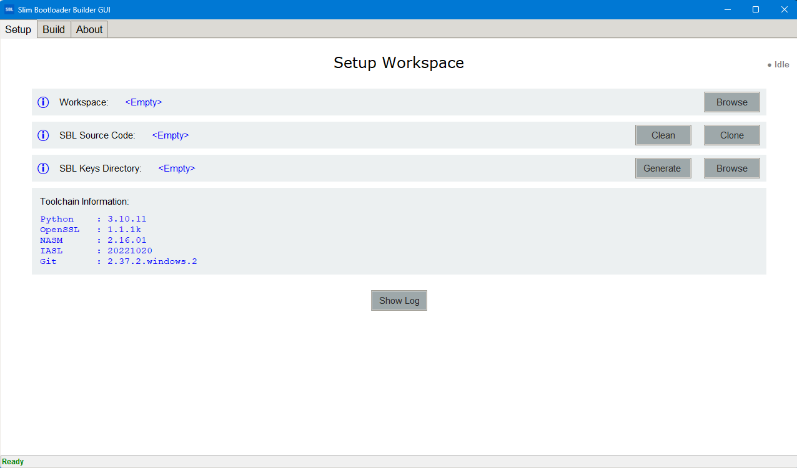
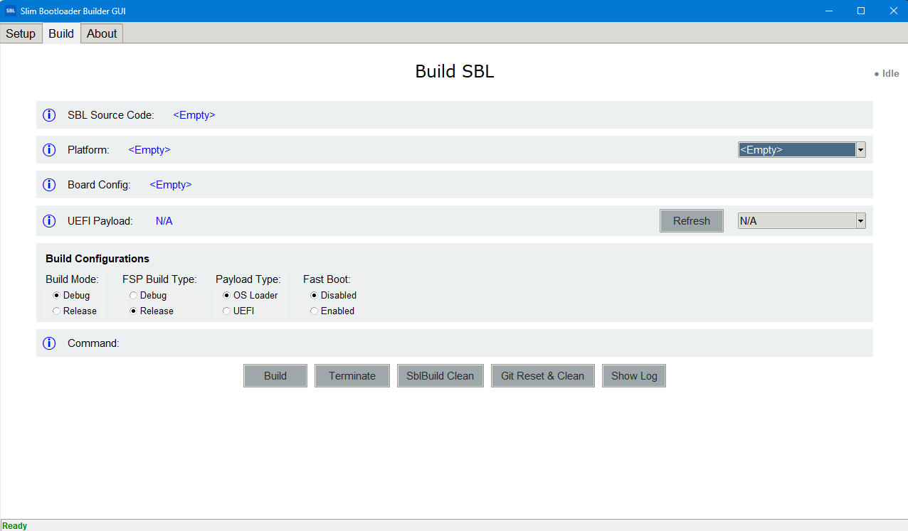

SblBuilderGui Tool
==================

Introduction
------------

SblBuilderGui is a graphical front end for the Slim Bootloader build flow.
It provides a convenient way to select a target board, choose build options,
preview the generated build command, and launch the same ``BuildLoader.py``
workflow used by the command-line build tool.

Usage
-----

The SblBuilderGui tool is designed to simplify common build tasks:

* Point the GUI to a Slim Bootloader source tree.
* Select a supported platform and board configuration.
* Choose the build mode, FSP build type, and payload type.
* Select a UEFI payload binary when the payload type requires one.
* Review the generated command in the command preview field.
* Click ``Build`` to run the build, or ``Clean`` to remove build artifacts.

The GUI refreshes available boards and payload files from the source tree so
the options stay aligned with the current repository contents.

Working
-------

SblBuilderGui is a thin orchestration layer over the standard Slim Bootloader
build pipeline. After the user selects the desired options, the tool
constructs the corresponding ``BuildLoader.py`` command and runs it in the
selected repository directory.

The high-level flow is:

* Configure inputs from the GUI controls.
* Preview the command that will be executed.
* Run the build in the SBL source directory.
* Produce build artifacts under the ``Outputs`` directory.

The underlying build flow follows the same stages described by the Build Tool
documentation, including environment initialization, pre-build processing, the
EDK II build step, and post-build packaging and stitching.

Screenshot
----------

Additional Links
----------------

* `Build Tool <https://slimbootloader.github.io/tools/BuildTool.html>`_